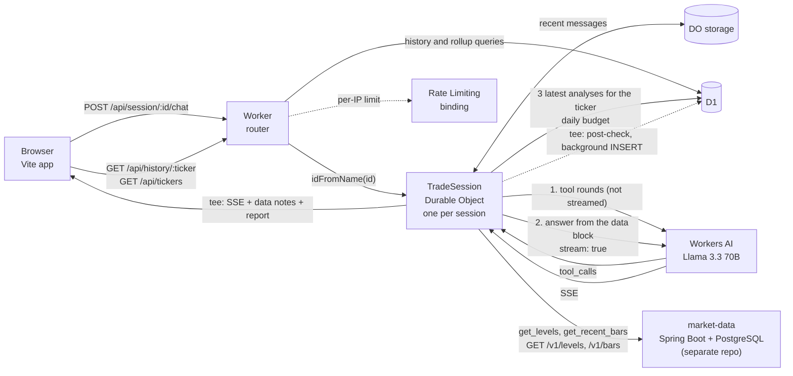

# TradeDesk

[](https://github.com/lokaz-c/cf_ai_tradedesk/actions/workflows/ci.yml)

A chat assistant for trading research that runs on Cloudflare. You pick an instrument and a timeframe, ask a question by typing or by voice, and Llama 3.3 70B on Workers AI streams back a structured answer: bias, key levels, a possible setup, and risk events to watch. Each session remembers its conversation, and a new session on the same instrument starts with the most recent saved analyses for it.

Price levels come from [market-data](https://github.com/lokaz-c/market-data), a separate service, not from the model's memory. The model fetches levels and recent bars through tool calls, the Worker checks every price-like number in the finished answer against what it fetched, and the page lists the levels the answer cited and flags any number that matches nothing. market-data's public endpoints serve synthetic demo data (Alpaca's terms forbid showing its data publicly without written consent), and answers and the page say so.

Built in April 2026 as the take-home for Cloudflare's software engineering internship. The brief asks for an LLM, a coordination layer, a chat input and persistent memory. `PROMPTS.md` lists the prompts used while building it, as the brief requires.

**Live demo:** https://cf-ai-tradedesk.pages.dev. It still runs an earlier build, without the security fixes, rate limits, caps and market-data grounding described below, until it is redeployed (see [Deploying](#deploying)).

## Architecture



## Design notes

The brief's four parts map to four pieces: Workers AI (`@cf/meta/llama-3.3-70b-instruct-fp8-fast`) is the LLM, a Durable Object per chat session is the coordination layer, the chat page with Web Speech API voice input is the user input, and Durable Object storage plus D1 are the memory.

**One Durable Object per session.** The Worker maps the session ID in the URL to a Durable Object with `idFromName`. Cloudflare runs at most one instance per ID and delivers its requests on a single thread, so the session's state (ticker, timeframe, message history) has one owner and needs no locks in application code. One caveat: the object handles other requests while it awaits D1 or Workers AI, and the user's message is only stored once the reply has finished, so two overlapping chats in one session each build their context without the other's turn.

**D1 for what outlives a session.** Every question and answer in a session that has a ticker is stored in D1 (SQLite), keyed by ticker. That table backs two things: the context for new requests (the three most recent analyses for the session's ticker) and the history sidebar (`/api/history/:ticker` and the per-ticker rollup `/api/tickers`). The schema is in `migrations/`. Both the history and the context queries are `WHERE ticker = ? ORDER BY created_at DESC LIMIT n`. With only a ticker index, SQLite found the matches and then sorted them in a temporary B-tree. Migration 0002 replaces it with a composite `(ticker, created_at)` index, which returns the rows already in order (read backwards), so the sort is gone and the scan stops after `n` rows. It also drops the `created_at` index, which no query used. `npm run db:explain` (from `worker/`) prints the plans after each migration, using a throwaway local D1:

```
After 0001_init.sql
history:
  SEARCH analyses USING INDEX idx_analyses_ticker (ticker=?)
  USE TEMP B-TREE FOR ORDER BY
context:
  SEARCH analyses USING INDEX idx_analyses_ticker (ticker=?)
  USE TEMP B-TREE FOR ORDER BY
tickers:
  SCAN analyses USING INDEX idx_analyses_ticker
  USE TEMP B-TREE FOR ORDER BY

After 0002_analyses_ticker_created_index.sql
history:
  SEARCH analyses USING INDEX idx_analyses_ticker_created (ticker=?)
context:
  SEARCH analyses USING INDEX idx_analyses_ticker_created (ticker=?)
tickers:
  SCAN analyses USING COVERING INDEX idx_analyses_ticker_created
  USE TEMP B-TREE FOR ORDER BY
```

The rollup's remaining sort is over one row per ticker (it orders by an aggregate), and the index now covers that query, so it no longer reads the table. The plans are for empty tables without `ANALYZE` statistics. A test in `d1.test.ts` asserts the history and context plans, so a schema change that brings the sort back fails CI.

**Context for each request.** The Durable Object sends the model the system prompt; when the session has a ticker, a line naming it and the timeframe, plus the three most recent analyses for that ticker, read from D1 on every request with each question and answer cut to 300 characters; then the newest stored messages (at most 20, and at most `MAX_HISTORY_CHARS` characters, starting at a user turn) and the new message. With grounding on, the final call's system prompt also ends with the data block from the tool rounds (next paragraph). Retrieval is by recency, not vector search.

**Grounding in market data.** Levels come from [market-data](https://github.com/lokaz-c/market-data), which computes classic floor pivots, 20- and 50-day highs and lows and the 52-week range in SQL and serves them at `/v1/levels/{ticker}`, with daily bars at `/v1/bars/{ticker}`. Cloudflare's [model page](https://developers.cloudflare.com/workers-ai/models/llama-3.3-70b-instruct-fp8-fast/) lists function calling for `@cf/meta/llama-3.3-70b-instruct-fp8-fast`: a request takes `tools` (`name`, `description`, JSON-schema `parameters`), and a non-streamed response returns `tool_calls` as `{ name, arguments }` (the same shapes are in `@cloudflare/workers-types`). The model's streaming output schema documents only a `text/event-stream` of text, not tool calls. So the Durable Object never streams a tool round:

1. Up to `MAX_TOOL_ROUNDS` (2) non-streamed calls offer `get_levels(ticker)` and `get_recent_bars(ticker, days)`, with `max_tokens` 256, since a round only needs to emit calls. The Worker runs what the model asks for (at most 3 calls a round and 4 in all; repeats are skipped), adds the calls and results to the conversation as in Cloudflare's [function-calling example](https://developers.cloudflare.com/workers-ai/features/function-calling/) (an assistant message with the calls as JSON, then one `tool` message per result), and stops when a round asks for nothing new. A reply whose whole text is a JSON tool call, Llama 3's own format, also counts as a call.
2. Each result becomes a labelled text block: the levels with their source and as-of date, or `NO DATA` / `UNAVAILABLE` with the reason.
3. The final call gets the blocks at the end of its system prompt, `stream: true`, and no tools, and streams to the browser as before.

The simpler alternative is to pre-fetch the session ticker's levels for every request and inject them. Tool calling covers a question about another ticker, or about bars, and fetches nothing for a question that needs no data. Its cost is one or two extra non-streamed model calls per request and a later first token. The rounds are capped, and the daily budget counts a request once however many rounds it takes (see the cost bound below). Without `MARKET_DATA_URL`, grounding is off: the model is told it has no price data, and the reply streams unchanged.

**The post-check.** When the answer has finished, the Worker extracts its price-like numbers (a decimal part, a thousands separator, a `$`, or a whole number of at least 100; not dates, ratios, list markers, counts such as "20-day", indicator lengths such as "SMA 200", digits inside tickers or level names, or whole numbers from 1900 to 2100, which it reads as years). Each one is compared with the values the Worker provided: every level, and for bars the latest bar and the window's high and low. A number matches when it is within half a unit of its last written digit (101.14 for 101.1367) or 0.05% of the value. Matches become the "levels cited" list; the rest are unverified, except numbers the user wrote in the question. The Worker then:

- adds a "Data notes" section to the answer: the source of the data (synthetic or not), any ticker with no data and why, and the unverified numbers;
- sends the report as one more server-sent event before `[DONE]` (`data: {"tradedesk": {"data": [...], "citations": [...], "unverified": [...]}}`), which the page shows under the answer;
- logs answers with unverified numbers (`console.warn`, `"event": "unverified_numbers"`) and stores the report with the analysis (`analyses.grounding`, migration 0004), so they can be counted: `SELECT sum(json_array_length(grounding, '$.unverified')) FROM analyses`.

The background copy runs the same check on the same text, so the saved answer and report match what the browser received. Without `MARKET_DATA_URL` the check still runs on the saved copy, and every price-like number is unverified.

**When market-data fails.** A timeout (`MARKET_DATA_TIMEOUT_MS`, 4 s), a connection error, a 5xx, a 429, a body in the wrong shape, or a 404 each become a block that tells the model what happened and what to write, and a data note in the answer. Tickers market-data cannot serve are refused without a request: its format is a letter, then letters, digits or a dot, so `GBP/USD` and `BTC-USD` get "no data".

**Synthetic data and Alpaca's terms.** market-data serves only synthetic data on its public endpoints by default (`PUBLIC_DATA_SOURCES=synthetic`), because Alpaca's terms forbid public display of its data without written consent. Synthetic data is labelled at every step: the block says `SYNTHETIC DEMO DATA: generated prices, not real market prices`, the system prompt tells the model to say so and never to call the values real prices, the Worker's data note says so in every answer that used it, and the page shows a `SYNTHETIC DEMO DATA` badge. `MARKET_DATA_DISPLAY_SOURCES` (default `synthetic`) lists the `source` values TradeDesk may show. Data from any other source is refused, even when `MARKET_DATA_API_KEY` lets the Worker read it.

**Streaming and persistence.** Workers AI returns a server-sent event stream. The Durable Object splits it with `tee()`. One branch is the response body, so the browser renders tokens as they arrive. The other is read in the background (`waitUntil`) and reassembled into the full reply, which is appended to Durable Object storage and inserted into D1. Persistence never delays the first token. Both readers use the same parser (`shared/sse.ts`), which only parses complete lines and carries a partial line or a split UTF-8 character into the next network read.

**Input and output handling.** Saved analyses are shared by every visitor, so the Worker validates what it stores: tickers must match `^[A-Z0-9]{1,10}([./-][A-Z0-9]{1,10})?$` after upper-casing (`GBP/USD`, `NQ`, `BRK.B`), timeframes must be one the page offers, and session IDs must be URL-safe. Anything else gets a 400 with an RFC 9457 problem body. The front end does not trust stored data either: values from the API are set with `textContent`, user messages are shown as plain text, and model replies are rendered with marked and sanitized with DOMPurify before they reach the DOM.

**Limits for a public demo.** Chat is the only route that costs money: each request runs Llama 3.3 70B on the account that hosts the Worker. It has three limits, all set in `worker/wrangler.toml`:

- *Per IP:* 5 chat requests per 60 seconds in each Cloudflare location, enforced with the [Workers Rate Limiting binding](https://developers.cloudflare.com/workers/runtime-apis/bindings/rate-limit/) (`CHAT_RATE_LIMITER`). The router checks it before the Durable Object runs, keyed on `CF-Connecting-IP`, with IPv6 addresses cut to their /64 because one client usually holds a whole /64. Over the limit, chat returns 429 with `Retry-After` and a problem body.
- *Per day, globally:* `DAILY_CHAT_BUDGET` (200) chat requests per UTC day across all users. The count lives in D1 (`daily_usage`, migration 0003) and is taken with one `INSERT ... ON CONFLICT DO UPDATE ... WHERE chat_requests < budget RETURNING`, so concurrent requests can't overshoot it. Only valid requests count. When it runs out, chat returns 429 until 00:00 UTC. Setting it to 0 turns chat off (503).
- *Per request:* messages up to `MAX_MESSAGE_CHARS` (2,000) characters; longer ones get 413, and the body reader stops at a byte limit sized for a maximal message. History sent to the model is capped at `MAX_HISTORY_CHARS` (6,000) characters, and replies at `MAX_OUTPUT_TOKENS` (512, down from 1,024). Characters, not tokens: counting tokens would need the model's tokenizer in the Worker.

Why the Rate Limiting binding for the per-IP limit: AI Gateway rate limiting applies one limit to every request through a gateway, so it can't tell visitors apart, and it is configured in the dashboard rather than in the repo. A Durable Object counter (one object per IP) would be exact, but it adds a Durable Object round trip to every chat request, plus windowing code to maintain. The binding is configured in `wrangler.toml`, runs locally in `wrangler dev` and in the vitest pool, and a check doesn't wait on the network. Its documented trade-off is accuracy: counts are kept per Cloudflare location and are eventually consistent. That is enough to slow down one visitor. The exact, global ceiling is the D1 budget, at the cost of one D1 write per chat request.

At the defaults, without grounding, the model generates at most 200 x 512 = 102,400 output tokens a day. At the [documented price](https://developers.cloudflare.com/workers-ai/models/llama-3.3-70b-instruct-fp8-fast/) ($0.293 per million input tokens, $2.253 per million output tokens) and 24,000-token context window, 200 requests cost at most 200 x 24,000 x $0.293/M + 102,400 x $2.253/M, about $1.64 a day. With grounding on, a request makes up to `MAX_TOOL_ROUNDS` + 1 model calls: at the default of 2, at most 3 x 24,000 input tokens and 2 x 256 + 512 = 1,024 output tokens, so 200 requests cost at most 200 x (72,000 x $0.293/M + 1,024 x $2.253/M), about $4.68 a day (about $3.16 with `MAX_TOOL_ROUNDS = 1`). These bounds assume every call fills the context window; the character caps keep real requests well below it.

**CORS.** Only the origins in `ALLOWED_ORIGINS` (the Pages site, and the Vite dev server, whose proxy forwards its own origin) get CORS headers. A browser request from any other origin, preflight included, gets a 403 before it reaches a route. That stops other sites from spending the demo's budget through their visitors' browsers. It does nothing against scripts, which send no Origin header; the limits above cover those.

## Run it locally

Requires Node 22 (22.22 or later) or Node 24 (24.15 or later), the versions jsdom 30 supports; the front-end tests use it. CI uses Node 24 LTS.

```bash
git clone https://github.com/lokaz-c/cf_ai_tradedesk.git
cd cf_ai_tradedesk
npm install                          # also installs worker/ and frontend/
(cd worker && npx wrangler login)    # once: chat calls Workers AI on your account
npm run dev                          # open http://localhost:5173
```

`npm run dev` applies the D1 migrations to a local database, starts the Worker on port 8787 with local Durable Objects and D1, and starts Vite on port 5173, which proxies `/api` to the Worker. Workers AI has no local simulator, so chat requests go to your Cloudflare account and count toward its Workers AI usage. Without a login, `npm run dev` exits with an authentication error. Use `npm run dev:no-ai` instead: everything except chat works, and chat requests return 500. The local Worker applies the same limits as production (see [Limits for a public demo](#design-notes)), including 5 chat requests a minute; change them in `worker/wrangler.toml`.

## Tests

```bash
npm test             # from the repo root: the Worker suite, then the front-end suite
npm run typecheck
```

There are 367 tests: 279 for the Worker and 88 for the front end (counts from `npm test`; CI runs the same two suites).

The Worker tests run inside workerd through `@cloudflare/vitest-plugin`, with the real Durable Object class and a local D1 database migrated from `migrations/`. Workers AI is replaced by a fake that returns a Workers AI style SSE stream (and, for tool rounds, `tool_calls` objects), market-data by a stubbed `fetch`, and remote bindings are disabled, so the tests never call a Cloudflare account or another service.

- `routing.test.ts`: status codes, method handling, 404s and CORS headers for every route; the origin allow-list, including look-alike origins and preflights.
- `context.test.ts`: the 20-message window (at 0, 1, 19, 20, 21 and 30 stored messages), the three newest same-ticker analyses in order with answers cut to 300 characters, and that D1 is read on every request.
- `d1.test.ts`: the migrated schema and indexes, the query plans (no temporary B-tree for history or context), the history route's limit and ordering, the rollup's counts and ordering, and session upserts with foreign keys enforced.
- `chat.test.ts`: the SSE bytes the client receives, the first event arriving before the model finishes, and the tee'd copy written to Durable Object storage and D1.
- `validation.test.ts`: accepted and rejected tickers, timeframes, session IDs and request bodies; rejected input stores nothing and never reaches the model; stored markup comes back as JSON with `nosniff`.
- `marketdata.test.ts`: the market-data client against a stubbed `fetch`: config parsing, ticker format checked before any request, `X-API-Key` sent only when set, numbers sent as strings, 400/401/404/429/5xx, a timeout, a connection failure, malformed bodies, the display-source check, and bar pagination.
- `grounding-chat.test.ts`: the tool loop end to end through the router and the Durable Object, with Workers AI and market-data mocked: non-streamed rounds with tools, then a streamed call with the data block and no tools; the round and call caps; repeated calls; a JSON tool call written as text; unknown tools; a failed round; market-data slow, down, 500 or 404, a ticker it cannot serve, and a source it may not display; the data notes, the report event, the stored copy and report; an unprovided price flagged, logged and stored; and grounding off.
- `grounding.test.ts` and `tools.test.ts`: number extraction (dates, ratios, list markers, periods, indicator lengths, tickers, years, signs, percentages), the tolerance, citations and unverified numbers, tool-call parsing, argument clamping, bar facts and the data notes.
- `limits.test.ts`: the per-IP limit, mocked (429 body and `Retry-After`, nothing reaches the Durable Object, the key for IPv4, IPv6 and IPv4-mapped addresses) and with the local rate-limit binding (one address blocked, another not); the daily budget (the last slot, exhaustion until 00:00 UTC, concurrent requests, rejected requests not counted, 0 turns chat off); the message, body, history and `max_tokens` caps; and parsing of the vars.

The front-end tests (`frontend/test/`) run in vitest with jsdom. They check that HTML payloads in a ticker, question, timestamp, user message, model reply (saved or streamed) or grounding report render as inert text or sanitized markup while ordinary markdown survives, that the on-screen reply is complete when the stream arrives in 1, 2, 3, 7, 64 or 4,096-byte reads, that the report event reaches the page and not the text, and that the report panel labels synthetic data and lists cited and unverified numbers.

Outbound requests to market-data are stubbed with `vi.spyOn(globalThis, "fetch")` (`worker/test/fetch-mock.ts`), which works because the Worker, its Durable Objects and the tests share one isolate. The Workers Vitest docs suggest `@msw/cloudflare`; with MSW 3 in this pool, every aborted request (the timeout tests) left an unhandled rejection inside the interceptor and failed the run.

Writing the tests found three bugs, all now fixed. The history route rejected URL-encoded tickers, so the sidebar got a 404 for the default instrument `GBP/USD`. And both the background copy and the on-screen copy of the stream were parsed one network read at a time, so tokens split across reads were dropped.

## Routes

| Method | Route | Handled by |
| --- | --- | --- |
| POST | `/api/session/:id/init` | Durable Object: set the ticker and timeframe, upsert the session row in D1 |
| POST | `/api/session/:id/chat` | Durable Object: stream a reply (SSE) and persist it in the background. With grounding on, tool rounds run first and the stream ends with the data notes and a `tradedesk` report event. Rate-limited per IP and by the daily budget |
| GET | `/api/session/:id/state` | Durable Object: the session and its message history |
| DELETE | `/api/session/:id/clear` | Durable Object: clear the message history (ticker, timeframe and saved analyses stay) |
| GET | `/api/history/:ticker` | Worker: the 20 most recent analyses for a ticker, with their grounding reports, from D1 |
| GET | `/api/tickers` | Worker: tickers with their analysis count and latest timestamp, from D1 |

Requests from an origin in `ALLOWED_ORIGINS` get CORS headers for that origin; requests from other origins get 403. All responses send `X-Content-Type-Options: nosniff`. Errors use RFC 9457 problem details (`application/problem+json`): 400 for invalid input, 403 for a disallowed origin, 404 for unknown routes, 413 for an oversized message, 429 with `Retry-After` for the per-IP limit or the daily budget, and 503 when chat is turned off.

## Repository layout

```
worker/src/index.ts       Worker router and the TradeSession Durable Object
worker/src/validation.ts  ticker, timeframe, session ID and request body validation
worker/src/limits.ts      limit vars, per-IP rate-limit key, history cap, daily budget
worker/src/http.ts        problem-details responses, capped JSON body parsing, CORS allow-list
worker/src/queries.ts     SQL for the analyses table
worker/src/marketdata.ts  market-data client: levels and bars, timeouts, errors, display-source check
worker/src/tools.ts       tool definitions, tool rounds, data blocks, data notes
worker/src/grounding.ts   the post-check: number extraction and matching against provided values
worker/src/stream.ts      re-emits the model's stream with the data notes and the report event
worker/scripts/           explain-query-plan.mjs (npm run db:explain)
worker/test/              Worker vitest suites and helpers
shared/sse.ts             parses the Workers AI SSE stream; used by the Worker and the front end
worker/wrangler.toml      bindings (AI, TRADE_SESSION, DB, CHAT_RATE_LIMITER) and limit vars
migrations/               0001 tables and indexes, 0002 (ticker, created_at) index, 0003 daily_usage,
                          0004 analyses.grounding
frontend/index.html       the chat page: markup and styles
frontend/src/             page script: streaming markdown render (marked + DOMPurify), grounding report,
                          voice input (Web Speech API), ticker and timeframe picker, quick prompts,
                          history sidebar
frontend/test/            front-end vitest suites (jsdom)
PROMPTS.md                the system prompt and the prompts used while building it
```

## Deploying

The Worker's bindings and settings are all in `worker/wrangler.toml`:

| Name | Kind | Default | Purpose |
| --- | --- | --- | --- |
| `AI` | Workers AI binding | | the model |
| `TRADE_SESSION` | Durable Object binding | | one object per chat session |
| `DB` | D1 binding | | analyses, sessions, daily usage |
| `CHAT_RATE_LIMITER` | Rate Limiting binding | 5 per 60 s | per-IP chat limit; `namespace_id` is any integer not used by another rate limiter on the account (period must be 10 or 60) |
| `ALLOWED_ORIGINS` | var | `https://cf-ai-tradedesk.pages.dev,http://localhost:5173` | browser origins that may call the API |
| `MAX_MESSAGE_CHARS` | var | 2000 | longest message accepted |
| `MAX_HISTORY_CHARS` | var | 6000 | stored conversation sent per request |
| `MAX_OUTPUT_TOKENS` | var | 512 | `max_tokens` per reply |
| `DAILY_CHAT_BUDGET` | var | 200 | chat requests per UTC day, all users; 0 turns chat off |
| `RATE_LIMIT_PERIOD_SECONDS` | var | 60 | `Retry-After` on a per-IP 429; keep equal to the binding's period |
| `MARKET_DATA_URL` | var | empty (grounding off) | base URL of the market-data service |
| `MARKET_DATA_API_KEY` | secret | unset | sent as `X-API-Key`; lifts market-data's per-IP rate limit. Set with `npx wrangler secret put MARKET_DATA_API_KEY`; never in `wrangler.toml` |
| `MARKET_DATA_DISPLAY_SOURCES` | var | `synthetic` | market-data sources TradeDesk may show; add `alpaca` only with Alpaca's written consent |
| `MARKET_DATA_TIMEOUT_MS` | var | 4000 | timeout for each market-data request |
| `MAX_TOOL_ROUNDS` | var | 2 | non-streamed tool rounds per chat request (1-4) |

The rate limiter needs no resource created in advance. To deploy to your own account, from `worker/`:

1. `npx wrangler d1 create tradedesk-db` and put its `database_id` in `wrangler.toml` (skip for an existing database).
2. `npx wrangler d1 migrations apply tradedesk-db --remote`. Run this before deploying the Worker: the Worker writes to `daily_usage` and `analyses.grounding`, which migrations 0003 and 0004 create.
3. Set `ALLOWED_ORIGINS` to your Pages URL (and any custom domain). For grounding, deploy market-data first, set `MARKET_DATA_URL` to its URL, and, if it has an API key for TradeDesk, run `npx wrangler secret put MARKET_DATA_API_KEY`. Keep `MARKET_DATA_DISPLAY_SOURCES = "synthetic"` unless Alpaca has given written consent. Then `npx wrangler deploy`.
4. From `frontend/`: `npm ci`, `VITE_WORKER_URL=https://<your-worker>.workers.dev npm run build`, then `npx wrangler pages deploy dist --project-name <name>`.

## Limitations

- The live demo runs an earlier build until it is redeployed: it has none of the security fixes, limits or caps above.
- The per-IP limit is approximate: the binding counts per Cloudflare location and is eventually consistent. Visitors behind one NAT or IPv6 /64 share a limit.
- The daily budget is shared, so one client cycling through many addresses can use it up and turn chat off for everyone until 00:00 UTC. Any request that passes validation counts, even if the model call then fails.
- Only chat is rate-limited. `/init` writes one session row per call, and the read routes query D1, but neither calls the model.
- No authentication. Session IDs are generated in the browser, and anyone with an ID can read that session. Saved analyses are global: every visitor's sidebar shows every saved analysis.
- Neither TradeDesk with grounding nor market-data is deployed yet; both wait for Lorenzo to deploy them. Until `MARKET_DATA_URL` is set, the model has no price data and is told to say "no data".
- The public market data is synthetic. Alpaca's terms forbid public display of its data without written consent, so market-data's public endpoints and `MARKET_DATA_DISPLAY_SOURCES` default to synthetic symbols (S001 to S050 in market-data's demo seed). The levels are computed correctly from generated prices; they are not real prices.
- market-data serves daily bars only, so levels and bars are daily whatever timeframe the session uses, and it covers US-equity-style tickers: forex pairs, futures and crypto get "no data".
- The post-check is a heuristic. It flags numbers derived from the data (a midpoint, a distance, a stop placed below a level) as unverified, it can miss a price written as a small whole number under 100 or as a year-like number, and it checks percentages only against backtest metrics. It reports; it does not block or rewrite an answer. Whether the model calls a tool at all is up to the model; when it does not, the data block says no data was retrieved and the check flags any price it writes.
- Tool calling with this model was tested only against mocks here, with the request and response shapes from Cloudflare's documentation and types; it has not been run against Workers AI from this repo.
- Memory is by recency, not relevance. The three prepended analyses can come from the current session, so they can repeat what is already in the message window.
- An exchange is stored only after the model finishes. If the stream fails partway, nothing is stored.
- `created_at` has one-second resolution, so analyses saved in the same second have no defined order.
