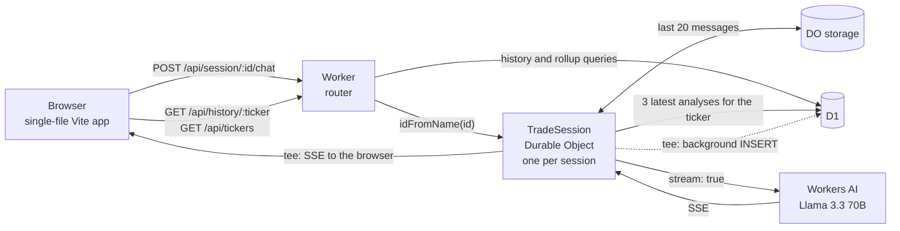

# TradeDesk

[](https://github.com/lokaz-c/cf_ai_tradedesk/actions/workflows/ci.yml)

A chat assistant for trading research that runs entirely on Cloudflare. You pick an instrument and a timeframe, ask a question by typing or by voice, and Llama 3.3 70B on Workers AI streams back a structured answer: bias, key levels, a possible setup, and risk events to watch. Each session remembers its conversation, and a new session on the same instrument starts with the most recent saved analyses for it.

Built in April 2026 as the take-home for Cloudflare's software engineering internship. The brief asks for an LLM, a coordination layer, a chat input and persistent memory. `PROMPTS.md` lists the prompts used while building it, as the brief requires.

**Live demo:** https://cf-ai-tradedesk.pages.dev. It runs an earlier build: it does not have the two fixes listed under [Tests](#tests), and it has no rate limiting yet (see [Limitations](#limitations)).

## Architecture



## Design notes

The brief's four parts map to four pieces: Workers AI (`@cf/meta/llama-3.3-70b-instruct-fp8-fast`) is the LLM, a Durable Object per chat session is the coordination layer, the chat page with Web Speech API voice input is the user input, and Durable Object storage plus D1 are the memory.

**One Durable Object per session.** The Worker maps the session ID in the URL to a Durable Object with `idFromName`. Cloudflare runs at most one instance per ID and delivers its requests on a single thread, so the session's state (ticker, timeframe, message history) has one owner and needs no locks in application code. One caveat: the object handles other requests while it awaits D1 or Workers AI, and the user's message is only stored once the reply has finished, so two overlapping chats in one session each build their context without the other's turn.

**D1 for what outlives a session.** Every question and answer in a session that has a ticker is stored in D1 (SQLite), keyed by ticker. That table backs two things: the context for new requests (the three most recent analyses for the session's ticker) and the history sidebar (`/api/history/:ticker` and the per-ticker rollup `/api/tickers`). The schema is in `migrations/0001_init.sql`, with indexes on ticker, session ID and `created_at`. The ticker index serves both the history and the context queries, and SQLite sorts the matches for `ORDER BY created_at DESC` in a temporary B-tree. Neither query uses the `created_at` index on its own; a composite `(ticker, created_at)` index would remove the sort. To check the plan locally:

```bash
cd worker && npm run db:migrate && npx wrangler d1 execute tradedesk-db --local \
  --command "EXPLAIN QUERY PLAN SELECT * FROM analyses WHERE ticker = 'NQ' ORDER BY created_at DESC LIMIT 20"
```

**Context for each request.** The Durable Object sends the model the system prompt; when the session has a ticker, a line naming it and the timeframe, plus the three most recent analyses for that ticker, read from D1 on every request with each answer cut to 300 characters; then the last 20 stored messages and the new message. Retrieval is by recency, not vector search.

**Streaming and persistence.** Workers AI returns a server-sent event stream. The Durable Object splits it with `tee()`. One branch is the response body, so the browser renders tokens as they arrive. The other is read in the background (`waitUntil`) and reassembled into the full reply, which is appended to Durable Object storage and inserted into D1. Persistence never delays the first token.

## Run it locally

Requires Node 22 or later (CI uses Node 24 LTS).

```bash
git clone https://github.com/lokaz-c/cf_ai_tradedesk.git
cd cf_ai_tradedesk
npm install                          # also installs worker/ and frontend/
(cd worker && npx wrangler login)    # once: chat calls Workers AI on your account
npm run dev                          # open http://localhost:5173
```

`npm run dev` applies the D1 migrations to a local database, starts the Worker on port 8787 with local Durable Objects and D1, and starts Vite on port 5173, which proxies `/api` to the Worker. Workers AI has no local simulator, so chat requests go to your Cloudflare account and count toward its Workers AI usage. Without a login, `npm run dev` exits with an authentication error. Use `npm run dev:no-ai` instead: everything except chat works, and chat requests return 500.

## Tests

```bash
npm test             # from the repo root, or from worker/
npm run typecheck
```

There are 61 tests (count from `npm test`, the same command CI runs). They run inside workerd through `@cloudflare/vitest-plugin`, with the real Durable Object class and a local D1 database migrated from `migrations/`. Workers AI is replaced by a fake that returns a Workers AI style SSE stream, and remote bindings are disabled, so the tests never call a Cloudflare account.

- `routing.test.ts`: status codes, method handling, 404s and CORS headers for every route.
- `context.test.ts`: the 20-message window (at 0, 1, 19, 20, 21 and 30 stored messages), the three newest same-ticker analyses in order with answers cut to 300 characters, and that D1 is read on every request.
- `d1.test.ts`: the migrated schema and indexes, the history route's limit and ordering, the rollup's counts and ordering, and session upserts with foreign keys enforced.
- `chat.test.ts`: the SSE bytes the client receives, the first event arriving before the model finishes, and the tee'd copy written to Durable Object storage and D1.

Writing them found two bugs, both now fixed. The history route rejected URL-encoded tickers, so the sidebar got a 404 for the default instrument `GBP/USD`. And the background copy of the stream was parsed one network read at a time, so tokens split across reads were dropped from the stored reply.

## Routes

| Method | Route | Handled by |
| --- | --- | --- |
| POST | `/api/session/:id/init` | Durable Object: set the ticker and timeframe, upsert the session row in D1 |
| POST | `/api/session/:id/chat` | Durable Object: stream a reply (SSE) and persist it in the background |
| GET | `/api/session/:id/state` | Durable Object: the session and its message history |
| DELETE | `/api/session/:id/clear` | Durable Object: clear the message history (ticker, timeframe and saved analyses stay) |
| GET | `/api/history/:ticker` | Worker: the 20 most recent analyses for a ticker, from D1 |
| GET | `/api/tickers` | Worker: tickers with their analysis count and latest timestamp, from D1 |

All routes send `Access-Control-Allow-Origin: *`. Unknown routes return 404.

## Repository layout

```
worker/src/index.ts       Worker router and the TradeSession Durable Object
worker/src/sse.ts         reassembles the reply text from the Workers AI SSE stream
worker/test/              vitest suites and helpers
worker/wrangler.toml      bindings: AI, TRADE_SESSION (SQLite-backed Durable Object), DB (D1)
migrations/0001_init.sql  sessions and analyses tables, indexes on ticker, session_id and created_at
frontend/index.html       the chat page: streaming markdown render (marked), voice input (Web Speech API),
                          ticker and timeframe picker, quick prompts, per-ticker history sidebar, Ctrl+K clears
PROMPTS.md                the system prompt and the prompts used while building it
```

## Deploying

Do not deploy a public copy until rate limiting is in place (see Limitations). To deploy to your own account, from `worker/`: create a database with `npx wrangler d1 create tradedesk-db`, put its `database_id` in `wrangler.toml`, run `npx wrangler d1 migrations apply tradedesk-db --remote`, then `npx wrangler deploy`. For the front end, from `frontend/`: run `VITE_WORKER_URL=https://<your-worker>.workers.dev npm run build`, then `npx wrangler pages deploy dist --project-name <name>`.

## Limitations

- No rate limiting or token caps yet. Every chat request runs Llama 3.3 70B (up to 1,024 output tokens) on the account that hosts the Worker, and the API accepts cross-origin requests from any site.
- No authentication. Session IDs are generated in the browser, and anyone with an ID can read that session. Saved analyses are global: every visitor's sidebar shows every saved analysis.
- The model gets no market data. Any price level it states comes from its training data, not from a feed, so treat the output as a writing aid, not a signal.
- Memory is by recency, not relevance. The three prepended analyses can come from the current session, so they can repeat what is already in the message window.
- An exchange is stored only after the model finishes. If the stream fails partway, nothing is stored.
- No input validation. A malformed body on `/init` or `/chat` returns a 500.
- `created_at` has one-second resolution, so analyses saved in the same second have no defined order.
- The front end parses each network read of the stream separately, so a token split across two reads can be missing on screen. The stored copy is complete.
